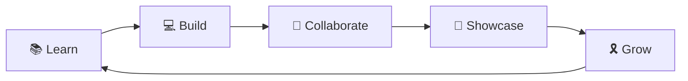

---

<!-- 🔥 ELUSOC NEWSFLASH -->

🟢 Open · Free · Open Source · Mentorship · Certificates · Prizes &nbsp;|&nbsp; <b>Spots are limited ~ don't wait!</b>

---

# Developers Capstone

**`(n.)` a project so good, it proves you actually learned something**

---

Look, we'll be real with you.

Most GitHub orgs write something like *"We are a vibrant community of passionate learners united by our love of technology..."*

We're not going to do that.

---

## What is this place?

**Developers Capstone** is where you take everything you've learned and finally build the thing you've been putting off. Not a tutorial. Not a clone. *Your* thing - with all the quirks, the bugs you'll actually have to fix, and the satisfaction of shipping it under an org that has your back.

We host capstone projects. We build together. We participate in real events. We run an internship that is (genuinely, not as a trick) free.

---

# 🎓✨ Welcome to **EduLinkUp** ✨🎓

### *Where Learning Meets Building. Where Students Become Creators.*

---

### 🌟 **You're Here Because You're Special** 🌟

You're part of an **elite community** of **students, developers, and open-source enthusiasts** who believe learning should be:

<table>
<tr>
<td align="center">🎗️ <b>Practical</b></td>
<td align="center">🤝 <b>Collaborative</b></td>
<td align="center">🎗️ <b>Accessible</b></td>
<td align="center">🎗️ <b>Impactful</b></td>
</tr>
</table>

---

## 🌱 **What is EduLinkUp?**

**EduLinkUp (ELU)** is a **student-driven educational revolution** - *by students, for students*.

> 🎯 **Our Mission**: Transform learners into builders through hands-on experience, real projects, and a thriving community.

### 🔥 **The EduLinkUp Way:**

| 🎓 **Learn** | 🛠️ **Build** | 🌐 **Collaborate** | 📈 **Grow** |
|:---:|:---:|:---:|:---:|
| Curated resources | Real-world projects | Open source contribution | Portfolio & network |
| Clear concepts | GitHub-worthy code | Community support | Career opportunities |

## What We’re Building (Present & Future)

### 🔹 Skill-Based Internships (Live)
Free, structured internships focused on:
- Learning from curated resources
- Explaining concepts clearly
- Building real, GitHub-worthy projects
- Creating portfolio-ready proof of work  

Domains include:
**Web | Backend | Full Stack | AI/ML | Data | Cloud | IoT | Cyber Security | Blockchain | Python**

### 🔹 Open Source & Community Collaboration
This GitHub Organisation serves as a hub for:
- Collaborating during **WoC, SWoC, Hacktoberfest**, and similar events  
- Hosting capstone projects under organisation ownership  
- Sharing ideas, resources, and discussions  
- Long-term collaboration beyond individual events  

---

### 🔹 What’s Coming Next
We’re actively working towards:
- Community hackathons & coding events  
- Workshops & live learning sessions  
- Free study materials & guides  
- Open-source initiatives under ELU  
- Courses & learning tracks (free-first approach)  

---

## 🎉 **Why You're Here (Yes, YOU!)**

### 🌟 **You've Been Handpicked** 🌟

<table>
<tr>
<td width="50%">

### **You Were Invited Because:**

- You've **contributed to open source**
- You're **serious about learning & building**
- You're someone we want to **collaborate with**
- You **align with our values**

</td>
<td width="50%">

### 🎁 **You're Free To:**

- **Explore** discussions & projects
- **Contribute** to ongoing initiatives
- **Join** future events & programs
- **Stay connected** with the community

</td>
</tr>
</table>

> 💜 **Remember:** You're not just a member. You're a **co-creator** of this community.

## 🌐 **Connect With EduLinkUp**

### **Join Our Growing Ecosystem** 🌟

   

---

### 🌱 **Join the Developer Community**

**Stay updated with everything happening in the EduLinkUp universe:**

---

### 📩 **Let's Connect Personally**

**Open to conversations about learning, open source, and community-building:**

---

## 💜 **Final Note** 💜

---

**EduLinkUp is still in its early chapters, and you're part of its origin story.**

<table>
<tr>
<td align="center">🎗️ <b>Curious?</b> Explore projects</td>
<td align="center">💡 <b>Motivated?</b> Start contributing</td>
<td align="center">🤝 <b>Collaborative?</b> Join discussions</td>
<td align="center">🌟 <b>Ready?</b> Let's grow together</td>
</tr>
</table>

---

### ✨ **Let's Learn. Build. Grow. Together.** ✨

